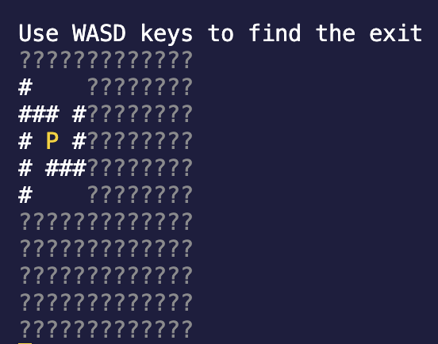

# Foggy Maze Game

## PRG2214 Functional Programming Principles - Final Assignment

A terminal-based foggy maze game built in Haskell.

---

## How to Play?

- Your location is denoted by P
- Hash symbols (#) are walls
- Question marks (?) are fogs
- Find the exit (E) in the maze
- Use the WASD keys to move
- Can only see small area around player
- Score is based on time taken and difficulty